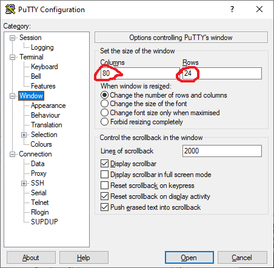

# puttyauto - A Python program to automate a PuTTY session on Windows

*** INCOMPLETE *** INCOMPLETE *** INCOMPLETE *** INCOMPLETE *** INCOMPLETE ***

*** INCOMPLETE *** INCOMPLETE *** INCOMPLETE *** INCOMPLETE *** INCOMPLETE ***

*** INCOMPLETE *** INCOMPLETE *** INCOMPLETE *** INCOMPLETE *** INCOMPLETE ***

Before getting into the nitty gritty (and, be warned, there is plenty of that to come) I must point out in the
`STRONGEST` possible terms that this program should never ever under any circumstances be used in any
sort of `CRITICAL` or `PRODUCTION` environment. It is really just a demonstration of how a Windows
program could be automated.

If you are here because you want a way to automate login sessions via ssh to Linux and other devices then
take a look at `expect` which is "A Tcl-based Toolkit for Automating Interactive Programs".

Right - let's dive in.

## YouTube video

I recommend you watch this YouTube video:

[Automating a PuTTY session with Python 3 and pyautogui](https://www.youtube.com/watch?v=OhQe1kwESLE)

It shows what the `puttyauto.py` Python 3 program does.

## Tested platforms

I have written and tested the program on a 64-bit x86 Windows 10 laptop.

If I get round to trying it on Windows 11 I will update this README.md with the experience (good or bad).

## Pre-requsites

You will need the following set up before you try running the `puttyauto.py` program:
    
### Python 3.9 or later installed

You can install Python from the Microsoft Store.

Or you can download an installer package by visiting:
    
[Python Releases for Windows](https://www.python.org/downloads/windows/)

Once Python is installed open a command prompt and run the command:

```
python -V
```

(note that is an UPPERcase V) - the output should be similar to:
    
```
Python 3.9.13
```

If you get errors you need to fix those before proceeding.

### Use pip3 to install PyAutoGUI

Open a command prompt and run:
    
```
pip3 install pyautogui
```

This will install the PyAutoGUI Pyton package and several other Python packages that are required dependencies.

### Download PuTTY version 0.83

Visit:
    
[Download PuTTY: release 0.83](https://www.chiark.greenend.org.uk/~sgtatham/putty/releases/0.83.html)

and under "Alternative binary files" download the 64-bit x86 `putty.exe` executable.

Copy it to the directory where you have downloaded the puttyauto.py and other supporting files.

Rename the file from `putty.exe` to `putty-0-83.exe` as follows:
    
```
rename putty.exe putty-0-83.exe
```

Run putty as follows:
    
```
putty-0-83.exe
```

On the PuTTY Configuration screen under Category click "Window".

Ensure columns are set to 80 and rows are set to 24 as follows:
    


Next on the PuTTY Configuration screen under Category click "Appearance" which is under "Window".

Ensure the font selection is "Fixedsys" with a point size of 12 as follows:
    


*** INCOMPLETE *** INCOMPLETE *** INCOMPLETE *** INCOMPLETE *** INCOMPLETE ***

*** INCOMPLETE *** INCOMPLETE *** INCOMPLETE *** INCOMPLETE *** INCOMPLETE ***

*** INCOMPLETE *** INCOMPLETE *** INCOMPLETE *** INCOMPLETE *** INCOMPLETE ***

----------------
End of README.md