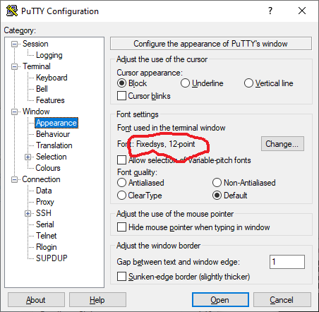
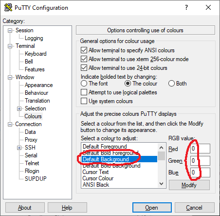
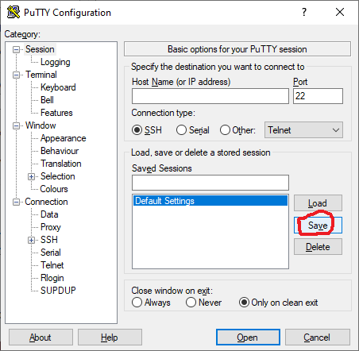

# puttyauto - A Python program to automate a PuTTY session on Windows

Before getting into the nitty gritty (and, be warned, there is plenty of that to come) I must point out in the
`STRONGEST` possible terms that this program should never ever under any circumstances be used in any
sort of `CRITICAL` or `PRODUCTION` environment. It is really just a demonstration of how a Windows
program could be automated.

If you are here because you want a way to automate login sessions via ssh to Linux and other devices then
take a look at `expect` which is "A Tcl-based Toolkit for Automating Interactive Programs".

Right - let's dive in.

## YouTube video

I recommend you watch this YouTube video:

[Automating a PuTTY session with Python 3 and pyautogui](https://www.youtube.com/watch?v=OhQe1kwESLE)

It shows what the `puttyauto.py` Python 3 program does.

## Tested platforms

I have written and tested the program on a 64-bit x86 Windows 10 laptop.

If I get round to trying it on Windows 11 I will update this README.md with the experience (good or bad).

## Pre-requsites

You will need the following set up before you try running the `puttyauto.py` program:
    
### Python 3.9 or later installed

You can install Python from the Microsoft Store.

Or you can download an installer package by visiting:
    
[Python Releases for Windows](https://www.python.org/downloads/windows/)

Once Python is installed open a command prompt and run the command:

```
python -V
```

(note that is an UPPERcase V) - the output should be similar to:
    
```
Python 3.9.13
```

If you get errors you need to fix those before proceeding.

### Use pip3 to install PyAutoGUI

Open a command prompt and run:
    
```
pip3 install pyautogui
```

This will install the PyAutoGUI Pyton package and several other Python packages that are required dependencies.

### Download PuTTY version 0.83

Visit:
    
[Download PuTTY: release 0.83](https://www.chiark.greenend.org.uk/~sgtatham/putty/releases/0.83.html)

and under "Alternative binary files" download the 64-bit x86 `putty.exe` executable.

Copy it to the directory where you have downloaded the puttyauto.py and other supporting files.

Rename the file from `putty.exe` to `putty-0-83.exe` as follows:
    
```
rename putty.exe putty-0-83.exe
```

### Configure PuTTY

Run putty as follows:
    
```
putty-0-83.exe
```

On the PuTTY Configuration screen under Category click "Window".

Ensure columns are set to 80 and rows are set to 24 as follows:
    


Next on the PuTTY Configuration screen under Category click "Appearance" which is under "Window".

Ensure the font selection is "Fixedsys" with a point size of 12 as follows:
    


Again on the PuTTY Configuration screen under Category click "Colours" which is under "Window".

Click on "Default Background" and then ensure the RGB value is 0 for Red, 0 for Green and 0 for Blue as follows:
    


Finally on the PuTTY Configuration screen under Category click "Session".

Click "Default Settings" and then click the "Save" button as follows:
    


Click the "Cancel" button to exit PuTTY.

PuTTY is now configured to (hopefully!) work on a way that the puttyauto.py program can "visually understand".

## Select a Linux host you want to test the puttyauto.py program on

We are now at a stage where we can run the puttyauto.py proggram to automatically login
to one of your Linux hosts.

Gather the following information about your host:
    
+ IP address or resolvable hostname of the host
+ The username to login as
+ The password to supply to successful login (keep this to yourself for obvious reasons)
+ The Linux prompt that gets displayed after a successful login

For example I have a Linux host called "roastick" (it stands for "Router On A STICK" :-) 

I login as user "localadm".

The password is ... opps nearly typed it there :-)

The Linux prompt is:
    
```
localadm@roastick:~ $
```

I will use these values but for your Linux host substitue the values that will work for you.


## Create a host script file

In the same directory that contains the puttyauto.py program, the putty-0-83.exe executable and
all the other supporting files create a file called:
    
```
myhost.txt
```

with the following content:
    
```
hostname = roastick
username = localadm
password = [PASSWORD]
prompt   = localadm@roastick:~ $

putty

send    uname -a
wait    prompt

send    grep '^root:' /etc/passwd
wait    prompt

send    cat /etc/resolv.conf
wait    prompt

screenshot

send    exit
```

You will need to change the values for hostname, username and prompt.

Leave the password line exactly as:
    
```
password = [PASSWORD]
```

## Let us run puttyauto.py (finally!!!)

Just before we run puttyauto.py we must set the environment variable PASSWORD to the password that
will be needed to login to the Linux host. For example:
    
```
set PASSWORD=Thisismysecurepassword
```

NOTE: this isn't my password :-)

After running this set command I would run:
    
```
cls
```

to clear the screen just incase someone might look over your shoulder.

Now, at long last, run:
    
```
python puttyauto.py myhost.txt
```

The PuTTY command should be invoked and automatically "driven" to login to your Linux host and
run the Linux commands in the myhost.txt file.

Assuming the run is successful a plain text file with a name similar to:
    
```
screenshot-IP/hostname-YYYYDDMM-HHMMSS.txt
```

should have been created. Look at teh content - it should prove useful.

## Trouble shooting

Many many things can and will go wrong.

This is because the puttyauto.py program relies on a lot of things "just working" and that the apearance of
PuTTY running on your system will match, exactly pixel by pixel, with how it runs on my system.

If you cannot get it running feel free to email me:
    
```
andy [ at ] cranstonhub [ dot ] com
```

and I will see if I can help but response times and valid solutions will vary greatly depending on my schedule. Please
be patient.

## Final words

This program is really just a "trick". It has a useful core concept of turning a section of screen pixels
into strings of ASCII characters but this is a very fragile way to operate. Hence my warning at the top of this document
that it should never be used on anything important.

----------------
End of README.md